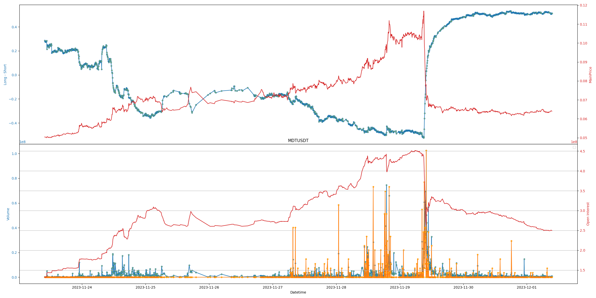
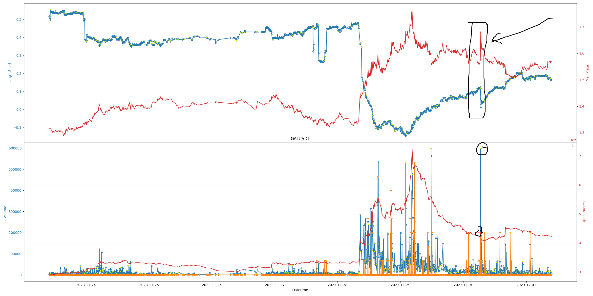
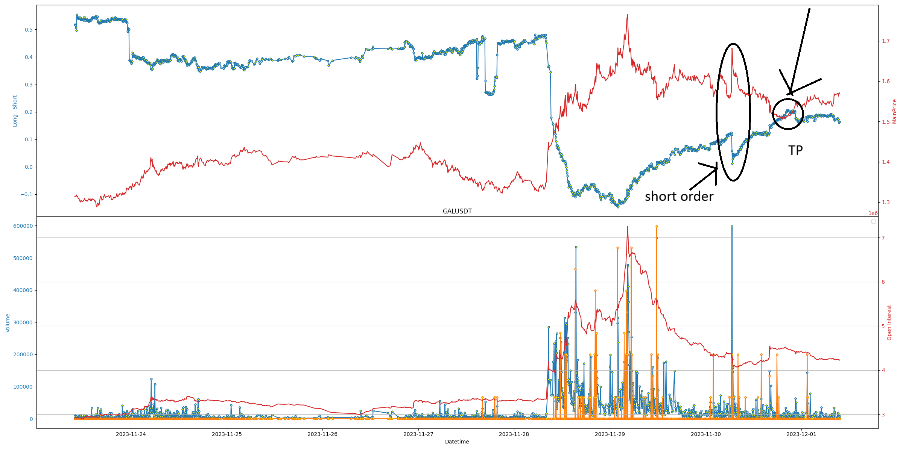

# The data under observation are close times, volume, open interest, long short ratio and liquidations

## Signal 1: 
### Description: Using FOMO market to gain profit
- If the long - short ratio is low (which means more short positions), open interest is high and volume is low, it's suitable to place a long order.
- The price must also already go up in recent candles. This guarantees that the market is bull
- Type: Scalp Trading
### Analysis:
- Volume low means the market is less likely to be volatile. Placing an order will not affect the price of the market. The gap between orderbook will be minimized
- High open interest means people are willing to open more short positions. This create a FOMO market and the coin price may go in reverse way to kill short positions, hence preserving market liquidation.

## Signal 2:
### Descripton: When the bubble burst
- When the long - short is abnormally low (reaching bottom), open interst is high while the market is abnormally bull recently, it's time for a bubble crash.

Example for a bubble crash

### Analysis
- All lines go in reverse directions after a bubble crash. This is especially for OI and Price: OI reduces dramatically while price also reduces.

## Signal 3:
### Description: Short killing / Long killing
- Let's take short killing as an example, it's also the same as long killing
- If the market is bear, price is down and long - short ratio is gradually climbing up, then abnormally:
+ Market is bull
+ Long - Short ratio falls
+ Open interest doesn't increase dramatically (preferably steady or decrease)
+ Volume is high (high volatility)
+ Number of liquidations is high

Example for a short killing

## Signal 4:
### Description: When to take profit
- After placing an order, the price may willingly to go in the direction we have predicted. In this case, we may notice that there is a gap between the long - short ratio and the price
- If our prediction is correct, then they will intersect at some point in the future
- That's where we cut our profit

Example of when to take profit

